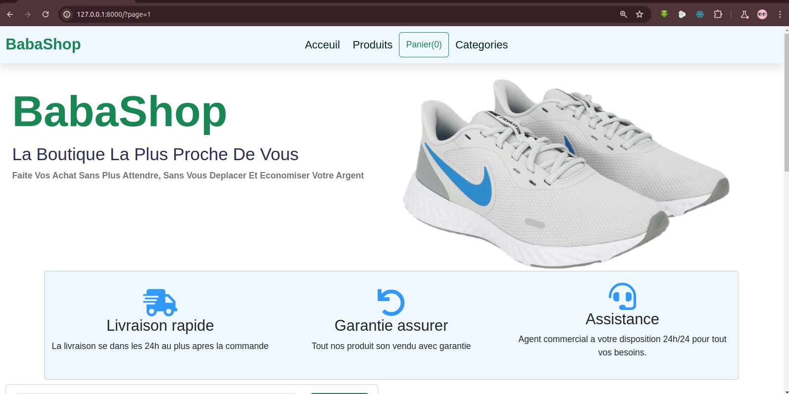

<h1 style="color:rgb(14, 233, 160)">django-site-ecommerce
 Baba Shop</h1>

petit site web de vente en ligne avec le framework django.
Ce site est pret a l'emploie avec quelque ajustement.

<h2 style="color:rgb(14, 233, 160);">Getting Started</h2>

Telecharger  dossier zipper puis decompresser le sur votre machine et 
ouvrer le fichier index.html a partir d'un navigateur 
installer l'environemnt virtuel et vous pourez lancer le projet. Bien sure vous devez avoir python3 installer

<h2 style="color:rgb(14, 233, 160);">Prerequisites</h2>

Pour lancer le projet vous aurez besoin de  :   
 <strong>-Python3 </strong> 

 <strong>-Django </strong> 

 <strong>-Navigateur </strong> 

 <strong>-Environnement virtuel python </strong> 

<h2 style="color:rgb(14, 233, 160);">Image du site web</h2>

